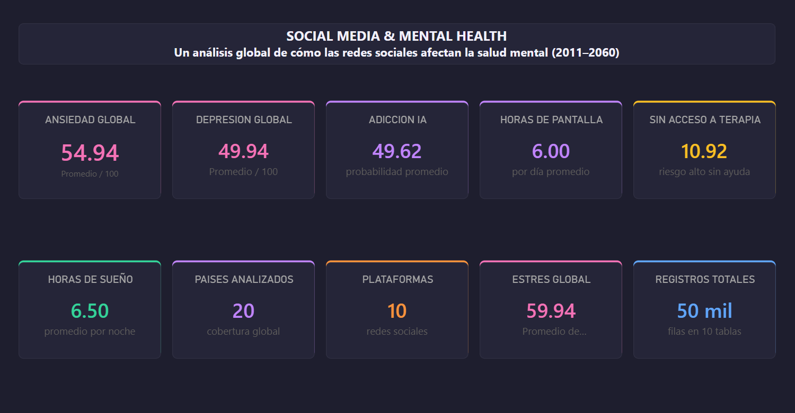
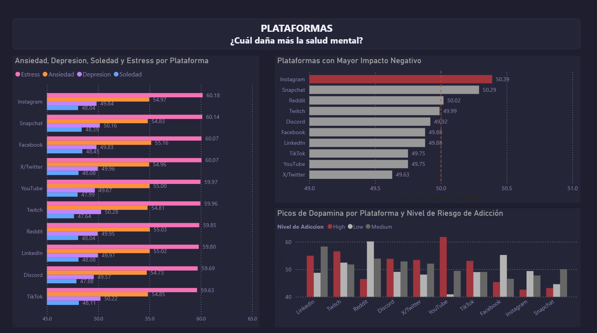
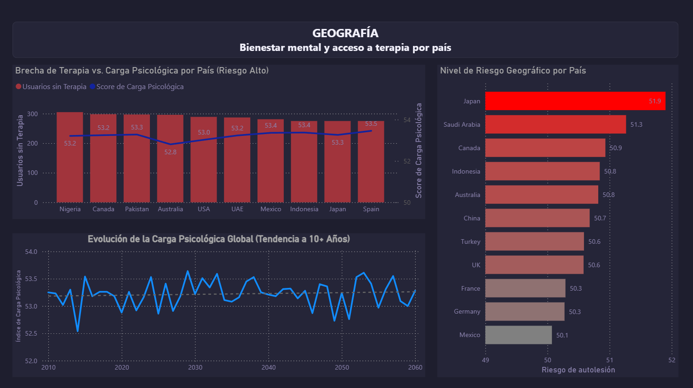
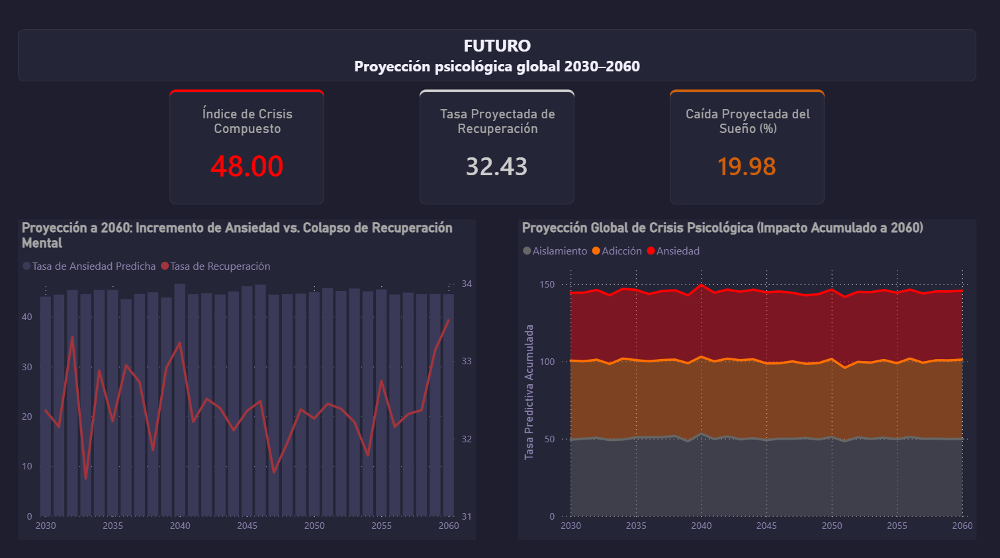

# Social Media & Mental Health — SQL + Power BI


Análisis del impacto del uso de redes sociales en la salud mental a nivel global. El proyecto va desde el diseño de la base de datos en SQL Server hasta un dashboard en Power BI, documentando las decisiones técnicas que fui tomando en el camino.

---

## Fuente de datos

| Campo | Detalle |
| :--- | :--- |
| **Dataset** | Social Media Addiction & Mental Health Dataset |
| **Autor** | Abdul Malik Lodhra |
| **Plataforma** | Kaggle ([Enlace al Dataset](https://www.kaggle.com/datasets/abdulmaliklodhra/social-media-addiction-and-mental-health-dataset)) |
| **Naturaleza** | Dataset sintético para análisis estadístico |
| **Volumen** | ~460,000 registros totales en 10 archivos CSV |

---

## Estructura del proyecto

```
SocialMedia_MentalHealth/
│
├── data/                          # CSVs originales de Kaggle
│   ├── mental_health_trends.csv
│   └── (9 archivos CSV adicionales)
│
├── sql/
│   ├── 01_crear_base_de_datos.sql # Creación de tablas, carga masiva e índices
│   └── 02_analisis_consultas.sql  # 20 consultas analíticas
│
├── assets/                        # Capturas del dashboard
│   ├── page1_resumen.png
│   ├── page2_algoritmos.png
│   ├── page3_geografia.png
│   └── page4_futuro.png
│
├── powerbi/
│   └── dashboard.pbix
│
└── README.md
```

---

## Tablas de la base de datos

| Tabla | Filas | Descripción |
| :--- | :--- | :--- |
| `mental_health_trends` | 50,000 | Tabla principal — ansiedad, depresión, estrés, acceso a terapia |
| `social_media_usage` | 50,000 | Uso general, tiempo de pantalla, riesgo de adicción |
| `screen_time_behavior` | 50,000 | Horas de pantalla, foco, actividad física |
| `sleep_disruption` | 50,000 | Horas de sueño, calidad, uso nocturno, notificaciones |
| `ai_recommendation_impact` | 50,000 | Algoritmos, cámaras de eco, manipulación emocional |
| `dopamine_trigger_metrics` | 50,000 | Engagement, videos cortos, dependencia a gratificación |
| `digital_detox_behavior` | 50,000 | Intentos de desintoxicación, recaídas, bienestar |
| `cyberbullying_impact` | 50,000 | Acoso digital, riesgo de autolesión, reporte |
| `teen_behavior_patterns` | 40,000 | Rendimiento académico, presión de pares, autoimagen |
| `future_psychological_forecast` | 30,000 | Proyecciones por año, país y plataforma hasta 2060 |

---

## Decisiones de diseño en SQL Server

### ¿Por qué no hay PRIMARY KEY?

Esto fue lo primero que tuve que resolver antes de cargar cualquier dato. Al analizar los CSVs encontré que ninguna columna — ni combinación de columnas — garantizaba unicidad por fila:

- **`user_id` solo:** 14,874 duplicados en 50,000 filas. Un mismo usuario aparece en múltiples años y plataformas, lo cual tiene sentido para un análisis histórico pero invalida la PK simple.
- **`user_id + year + platform`:** Sigue habiendo 105 duplicados. Extender la clave a 6 columnas lo reduce a 1, pero una PK de 6 columnas es difícil de mantener y costosa en rendimiento.
- **`record_id` autoincremental:** Funciona técnicamente, pero obliga a usar tablas temporales durante el `BULK INSERT` porque el CSV no tiene esa columna. Agrega complejidad sin aportar ningún valor al análisis.

La conclusión fue no definir PRIMARY KEY. El dataset fue creado para análisis estadístico, no para un sistema transaccional, y tratarlo como si fuera uno solo genera problemas innecesarios. Las tablas se relacionan mediante JOIN por contexto compartido: `user_id` como campo de referencia, con CTEs de agregación donde fue necesario para evitar multiplicidad de registros.

### Tipos de datos

| Tipo | Uso | Por qué |
| :--- | :--- | :--- |
| `INT` | `user_id`, conteos | Rango amplio sin límite definido |
| `SMALLINT` | `year` | Los años 2011–2060 caben en 2 bytes en lugar de 4 |
| `NVARCHAR` | `country`, `platform`, `gender` | Soporte Unicode; tamaño ajustado al valor más largo real + margen |
| `DECIMAL(5,2)` | Scores 0–100 | Precisión exacta, 3 dígitos enteros + 2 decimales |
| `DECIMAL(4,2)` | Horas 0–24 | Máximo 24.00, no necesita 3 dígitos enteros |
| `DECIMAL(5,4)` | Probabilidades | Rango 0.0000–1.0000, requiere 4 decimales |
| `BIT` | Flags booleanos | Los CSVs traen texto `'True'`/`'False'`; se convierte a BIT después de la carga |

### Técnicas SQL aplicadas

- **CTEs** para pre-agregar datos por usuario y evitar multiplicación de filas en los JOINs.
- **`NULLIF`** en divisiones para prevenir errores por división entre cero.
- **Agregación condicional** con `CASE WHEN` dentro de `SUM` y `AVG`.
- **Scores ponderados** para construir índices compuestos como `algorithmic_danger_score`.

---

## Los 20 análisis

### Grupo 1 — Consultas directas (01–09)

| # | Pregunta | Tablas | Visualización |
| :--- | :--- | :--- | :--- |
| 01 | ¿Qué plataforma daña más la salud mental? | mental_health | Barras horizontales |
| 02 | ¿Los algoritmos crean adicción vía dopamina? | dopamine + ai + social_media | Scatter plot |
| 03 | ¿La edad protege o empeora el impacto digital? | mental + screen + cyberbullying | Columnas agrupadas |
| 04 | ¿Hacia dónde vamos si no cambiamos nada? | future_forecast | Área apilada 100% |
| 05 | ¿El uso nocturno de pantallas causa depresión? | sleep + mental | Línea + columnas |
| 06 | ¿Desconectarse mejora la salud mental? | digital_detox + mental | Línea |
| 07 | ¿Dónde están los adolescentes más en riesgo? | cyberbullying + teen | Mapa coroplético |
| 08 | ¿Instagram afecta más a mujeres que a hombres? | mental + teen | Matriz |
| 09 | ¿Cuál es el estado actual global? | Todas | KPI Cards |

### Grupo 2 — Columnas calculadas (10–20)

| # | Pregunta | Columna calculada | Fórmula |
| :--- | :--- | :--- | :--- |
| 10 | ¿Quién tiene el peor equilibrio digital-físico? | `screen_vs_activity_ratio` | Total horas pantalla ÷ Horas actividad física |
| 11 | ¿Dónde se niega el acceso a terapia? | `treatment_gap` | Riesgo='High' AND Terapia=0 → 1 |
| 12 | ¿Qué algoritmo es más dañino? | `algorithmic_danger_score` | (Echo×0.3) + (Manipulación×0.4) + (Adicción×0.3) |
| 13 | ¿Qué tienen en común los teens en crisis? | `teen_vulnerability_index` | Promedio(Autoimagen, Presión social, Comparación) |
| 14 | ¿A qué edad afecta más el bombardeo nocturno? | `digital_bedtime_pressure` | Horas nocturnas × Notificaciones |
| 15 | ¿Estamos peor que hace 10 años? | `psychological_burden_index` | Promedio(Ansiedad, Depresión, Estrés, Soledad) |
| 16 | ¿Los usuarios de TikTok recaen más? | `detox_efficiency_score` | Mejora bienestar ÷ Intentos de detox |
| 17 | ¿A mayor dopamina, peor rendimiento escolar? | `addiction_pressure_index` | Dopamina × (Refresh ÷ 100) × Gratificación |
| 18 | ¿Los algoritmos manipulan más a mujeres? | `algorithmic_danger_score` | Por género y plataforma |
| 19 | ¿Duermen menos los que tienen peor salud mental? | `psychological_burden_index` | Correlación sueño vs carga mental |
| 20 | ¿Cuánto empeora el mundo hacia 2060? | `crisis_composite_index` | (Ansiedad×0.4) + (Adicción×0.35) + (Aislamiento×0.25) |

---

## Dashboard Power BI

El modelo se alimenta directamente con las consultas SQL pre-agregadas, lo que evita hacer cálculos pesados en DAX y mantiene el dashboard rápido.

### 1 — Panorama Global

Vista de portada con los KPIs principales del dataset.



Los números más llamativos de entrada: ansiedad promedio en 54.94, estrés en 59.94 (el más alto de todos), y solo un 10.92% de usuarios con riesgo alto sin acceso a terapia. Ese último número parece bajo pero en términos absolutos sobre 50,000 registros empieza a ser significativo.

---

### 2 — Plataformas: Algoritmos y Dopamina

Qué plataforma hace más daño y por qué.



Instagram lidera el peligro algorítmico con 50.39 puntos. Lo interesante no es solo el número sino el gráfico de dopamina por nivel de riesgo: los picos más altos concentran casi todos los usuarios de "Alto Riesgo" (barras rojas). No es coincidencia, es diseño.

---

### 3 — Geografía: Bienestar y Acceso a Terapia

Dónde está el problema y dónde no hay recursos para atenderlo.



Japón encabeza el índice de riesgo de autolesión con 51.9. Lo que más me llamó la atención al analizar esto es que la brecha de tratamiento se mantiene estable a lo largo del tiempo — no mejora. El problema crece pero la infraestructura de salud mental no le sigue el ritmo.

---

### 4 — Futuro: Proyección 2030–2060

Cómo se ve el panorama si no cambia nada.



El gráfico de área apilada muestra algo que no esperaba: la ansiedad proyectada se mantiene como un bloque sólido e inamovible década tras década, mientras que la tasa de recuperación clínica sube y baja sin ninguna tendencia clara de mejora. El problema de fondo no es solo cuánta gente se afecta, sino que el sistema no está mejorando su capacidad de rehabilitarlos.

---

## Cómo reproducir el proyecto

1. Clona el repositorio: `git clone https://github.com/aroman2727/Social-Media-Mental-Health-Analysis`
2. Descarga los CSVs desde [Kaggle](https://www.kaggle.com/datasets/abdulmaliklodhra/social-media-addiction-and-mental-health-dataset) y colócalos en una ruta local.
3. Abre `01_crear_base_de_datos.sql` en SSMS, ajusta las rutas del `BULK INSERT` y ejecuta el script completo.
4. Abre `02_analisis_consultas.sql` para explorar las consultas.
5. Conecta Power BI: Obtener datos → SQL Server → `SocialMedia_MentalHealth`.

---

## Autor

**Aaron Alejandro Kiwaki Alvarez**
Ingeniero Mecatrónico con 5 años en telecomunicaciones, en transición hacia roles de Data Analytics y Business Intelligence.

- LinkedIn: [aaron-kiwaki](https://www.linkedin.com/in/aaron-kiwaki/)
- Email: alejandro.kiwaki@gmail.com

---

*Dataset utilizado bajo los términos de uso de Kaggle. Todos los datos son sintéticos.*
